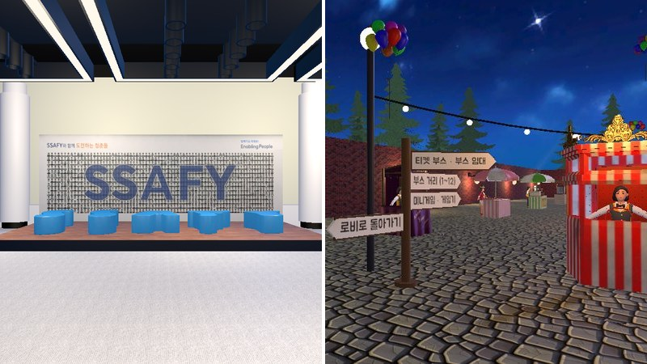
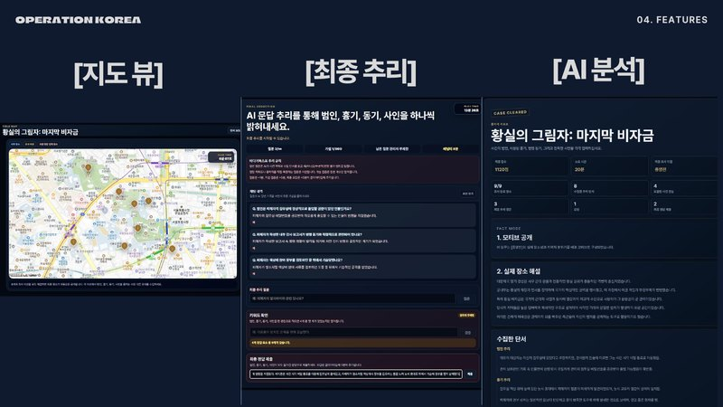
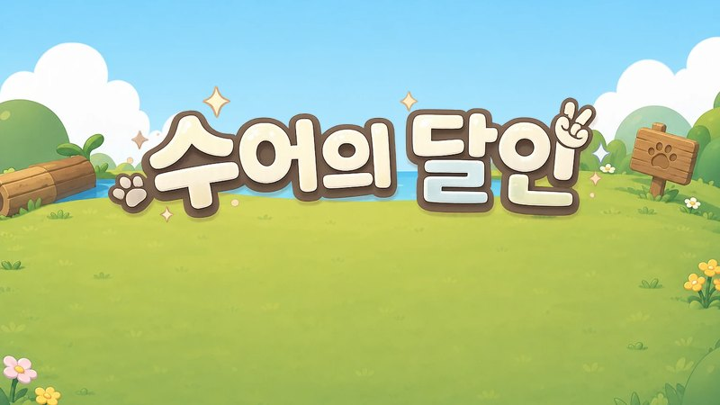
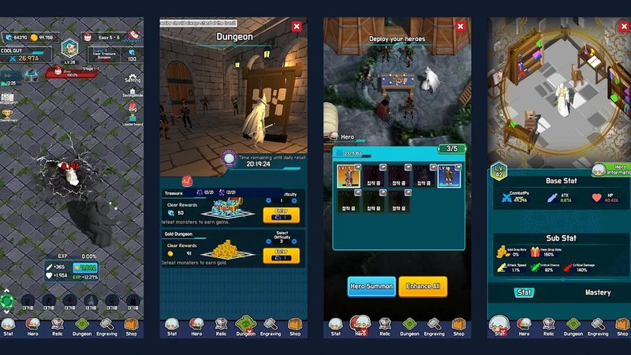
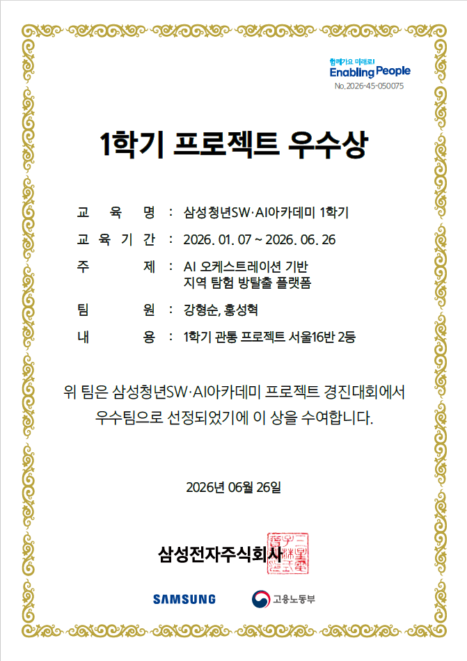

# 강형순

웹과 AI에서 나온 데이터를 Unity 3D와 게임 화면에서 동작하게 만드는 개발을 해 왔습니다. SSAFESTA에서는 실제 SSAFY 캠퍼스 11층 모델과 웹에서 꾸민 부스를 Unity WebGL 월드에 올리고 여러 명이 동시에 접속하게 만들었습니다. Operation KOREA에서는 실제 장소 정보로 AI가 만든 사건을 서버에서 검사해 지도 기반 게임으로 만들었습니다. 서버는 Java·Spring으로 만들고, 혼자 만든 Unity 게임을 Google Play에 출시했습니다. 두 팀 프로젝트에서는 팀장으로 일정과 개발 규칙을 정했습니다.

프로젝트별로 어떤 문제를 어떻게 풀었는지는 [노션 포트폴리오](https://lapis-tuna-1ef.notion.site/3ef2ff41a8f38167a96fdc7f8732f818)에 정리했습니다.

**주로 쓰는 기술**

| 기술 | 쓴 곳 |
| --- | --- |
| Unity(C#) · Netcode for GameObjects | SSAFESTA WebGL 월드·전용 서버·건물 모델 최적화, 사제의 길 출시 |
| Java · Spring Boot · MyBatis · MySQL | Operation KOREA 백엔드. API, 생성 결과 검사 코드, JUnit 테스트 |
| Gemini·OpenAI API · MCP · Codex · Claude Code | Operation KOREA 사건 생성, SSAFESTA 트러블 기록·이슈 공유 자동화, DUO |
| Git · GitLab · Jira | SSAFESTA에서 브랜치·커밋 규칙을 정하고 Jira로 일정 관리 |

**써 본 기술**

| 기술 | 쓴 곳 |
| --- | --- |
| Unreal Engine(C++) | 멀티플레이 TPS, 잠입 액션 RPG |
| React · TypeScript | 수어의 달인 게임 화면, DUO |
| Docker | SSAFESTA Unity 전용 서버를 이미지로 만들어 로컬에서 접속 확인 |
| GitHub Actions | Operation KOREA와 DUO 테스트를 푸시할 때마다 실행 |

## 대표 프로젝트

<table>
  <tr>
    <td width="50%" valign="top">
      
      
<b><a href="https://github.com/kanghyunsoon/SSAFESTA-Portfolio">SSAFESTA</a></b> 
      Unity WebGL · Netcode · Linux 서버 / 6인 팀, 팀장

      
웹에서 꾸민 부스를 Unity 월드에 불러오는 클라이언트와 전용 서버를 맡았습니다. 팀원이 SketchUp으로 만든 캠퍼스 11층 모델을 가져와 오브젝트 2,043개를 156개로 합쳤고, 부스 구역 드로우콜은 1,088회에서 231회로 줄였습니다. 구현 전에 팀원들과 담당 범위, 완료 조건, Git 규칙을 정하고 Jira로 일정을 관리했습니다.

    </td>
    <td width="50%" valign="top">
      
      
<b><a href="https://github.com/kanghyunsoon/operation-seoul">Operation KOREA</a></b> 
      Java · Spring Boot · Gemini / 2인 팀, 팀장

      
장소 정보로 AI가 추리 사건을 만들고, 서버가 검사한 뒤 저장하는 백엔드를 맡았습니다. 범인이 용의자 목록에 없거나 정답이 단서에 드러나는 결과가 나와서 생성 단계를 나누고 검사 코드를 붙였습니다. 에피소드 생성·관리 쪽 테스트는 67개입니다.

      
SSAFY 1학기 프로젝트 우수상

    </td>
  </tr>
  <tr>
    <td width="50%" valign="top">
      
      
<b><a href="https://github.com/kanghyunsoon/sign-language-game">수어의 달인</a></b> 
      TensorFlow·TFLite · React · WebRTC / 6인 팀

      
웹캠으로 읽은 손 모양을 게임 입력으로 쓰는 웹게임입니다. AI의 도움을 받아 지문자 인식 모델의 학습 스크립트를 작성하고 튜닝했고, 순간 오인식이 판정에 들어가지 않도록 같은 결과가 100ms 이상 이어질 때만 입력으로 받게 했습니다. 게임 선택 이후 프론트엔드와 WebRTC 1:1 대전도 맡았습니다.

      
<a href="https://sudal-play.vercel.app">서비스</a>

    </td>
    <td width="50%" valign="top">
      
      
<b><a href="https://github.com/kanghyunsoon/PathOfPriestPortfolio">사제의 길: 낮과 밤</a></b> 
      Unity · C# · Firebase / 1인 개발

      
방치형 RPG를 혼자 만들어 Google Play에 출시했습니다. 로그인, 진행 저장, 광고, 결제를 붙였고, 출시 뒤에는 Android SDK 의존성 충돌과 회원 탈퇴 기능을 고쳐 업데이트했습니다.

      
<a href="https://play.google.com/store/apps/details?id=com.KHS.MonsterRaidIdle">Google Play</a> · <a href="https://youtu.be/jKvEW6LIzaw">플레이 영상</a>

    </td>
  </tr>
</table>

## 지금 만들고 있는 것

**[DUO](https://github.com/kanghyunsoon/duo)** · TypeScript · 개인 오픈소스 · [npm](https://www.npmjs.com/package/@duo-director/cli)

AI 코딩 에이전트가 바꾼 코드가 팀이 정한 결정과 어긋나는지 파일과 줄 단위로 알려 주는 도구입니다. SSAFESTA에서 AI가 파트 사이에서 바뀐 결정을 놓쳐 통합 단계에서야 오류가 드러난 적이 있어서 시작했습니다. 코드는 AI 코딩 에이전트와 함께 쓰고, 무엇을 검사할지와 테스트 기준은 제가 정합니다.

테스트는 Ubuntu·Windows·macOS에서 똑같이 돌리고, npm에 올리기 전에 패키지를 실제로 설치해 CLI가 동작하는지도 확인합니다.

## 그 밖의 프로젝트

Paws Diary · 멀티플레이 TPS · 잠입 액션 RPG

- [Paws Diary](https://github.com/kanghyunsoon/Paws-on-Keyboard): 관광데이터 공모전 프로젝트입니다. Ennoia에서 사진 분석, 장소 추천, 일기, 그림 생성 에이전트의 역할과 순서를 짰고, 도구에서 바로 부를 수 없던 Hugging Face 모델은 [FastAPI 프록시](https://github.com/kanghyunsoon/HF_ProxyAPI)로 연결했습니다.
- [멀티플레이 TPS](https://github.com/kanghyunsoon/NetworkShooterPortfolio): Unreal C++. 서버가 캐릭터 콜리전을 발사 시점으로 되돌려 명중을 다시 판정합니다.
- [잠입 액션 RPG](https://github.com/kanghyunsoon/StealthActionRPGPortfolio): 첫 Unreal 프로젝트입니다. 커버 이동, 발 위치 보정, Behavior Tree AI를 만들었습니다.

## 교육·수상

- SSAFY 15기 Java 풀스택 과정 (2026.01~)
- 서울게임아카데미 3D 게임 프로그래머 양성과정 수료
- SSAFY 15기 1학기 프로젝트 우수상 · Operation KOREA, 서울 16반 2등

상장 보기

